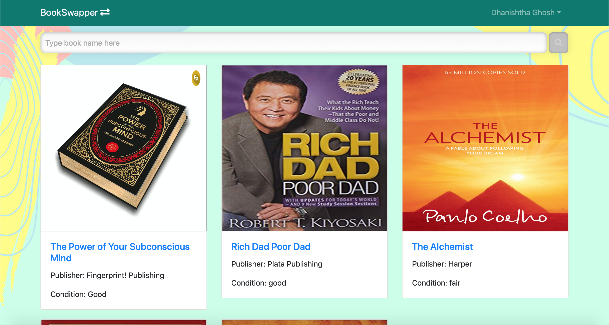
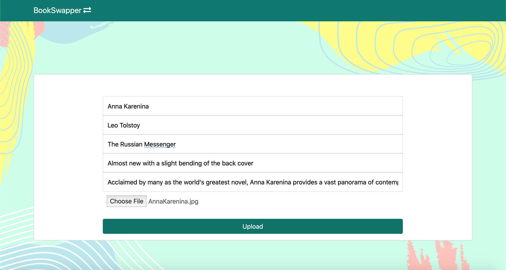
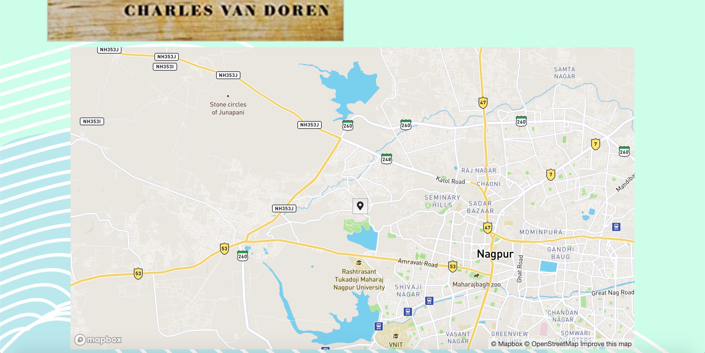

# BookSwapper

## Description

Our project tries to create to a platform for conducting the traditional book swapping in a more sophisticated manner.

- You create an account, or else login in if you have already cleared that step
- Search for a book you wish to have/read in our Books section
- If you find the book of your choice, you can then see the details of the person willing to give their book by clicking the book title
- Detailed information about book and user are available on the page, after clicking the book title of any book in the Books section
- You may also view their location on our embedded Map built with the help of Mapbox API
- You can then go forward and email that person regarding the book and how to swap it
- You can also upload books of your own in the My Books section inside your account name 

----

## Steps to run

Steps to run our project on your local machine:
1. Clone our repository
````
https://github.com/dhanishthaghosh/BookSwapper.git
````

2. Go into the directory/folder
````
cd BookSwapper/
````

3. In the present directory, run the following command
````
npm install
````

4. After the above step is completed, go into the directory/folder named frontend
````
cd frontend/
````

5. Once inside the directory, run the following command
````
npm install
````

6. After the above step is completed, go back to the root directory/folder
````
cd ..
````

7. Run the following command 
````
npm run dev
````

----

- GitHub Repository Link: [BookSwapper](https://github.com/dhanishthaghosh/BookSwapper)
- Google Drive Link (for images): [BookSwapper-images](https://drive.google.com/drive/folders/1ML3VXxbuGjcQH0yNg1UcC3IQ5GWcv8Eo?usp=sharing) 


## Technology Stack
- HTML
- CSS
- Bootstrap (a free and open-source CSS framework directed at responsive, mobile-first front-end web development)
- React (an open-source front-end JavaScript library for building user interfaces or UI components)
- Express.js (an open-source back-end web application framework for Node.js)
- Node.js (an open-source, cross-platform, back-end JavaScript runtime environment that runs on the V8 engine)
- MongoDB (a source-available cross-platform document-oriented database program)

## Applications
> The very idea of this project struck to us when we were idly wandering about on Instagram. There book-swapping challenges would be held for people to participate. We thought why not implement a website where people would actually be able to know in a sophisticated manner, who in their vicinity has certain books and are interested in swapping them.

- It reduces the hassle of finding custom challenges to swap your books
- Not interested in buying and selling, but rather sharing, you are in the right place!
- Getting to know the location of the person so that we know how much distance to cover beforehand


## Future scope

- We intend on changing the map view to display all users bearing that particular book to be displayed on the map at once, so that user can have the benefit of choosing the nearest one

- We intend on developing an in-application chatbox since not many people will be comfortable sharing their phone numbers or email addresses

----

## Screenshots


 



